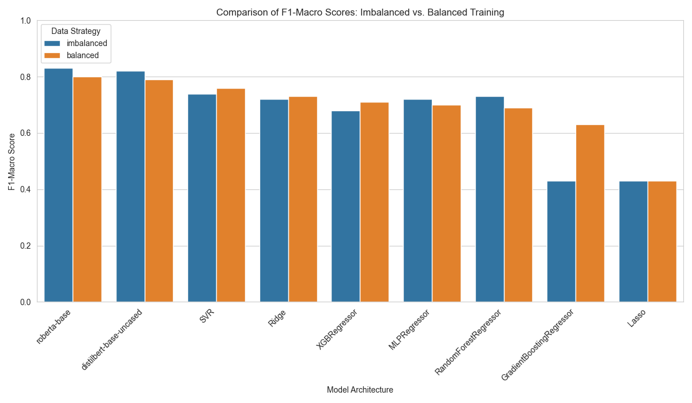
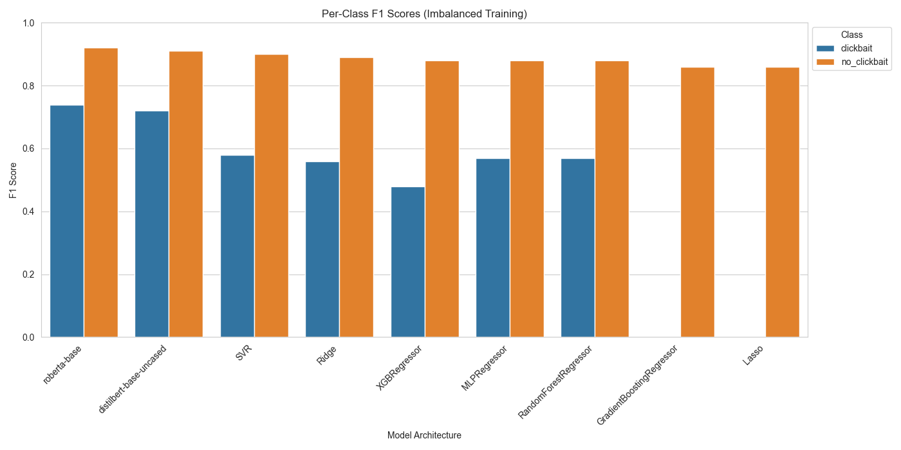
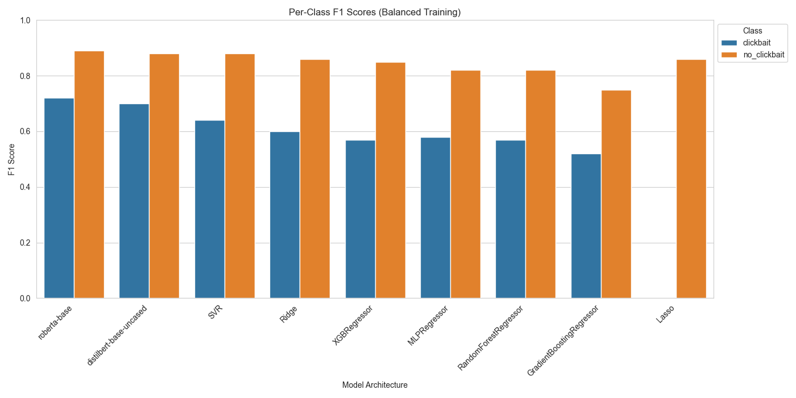

# Clickbait classification

Term project for Internet and Classification Methods course at MFF, Charles University

*Author: Peter Kochelka*

## Task

Develop a machine learning model that will classify Twitter posts as either clickbait or non-clickbait. Given the subjective nature of the task, the model must learn to map textual patterns to human-annotated labels.

## Data

**Source**: <https://webis.de/data/webis-clickbait-17.html>

**Overview:**

- 38 517 Twitter posts from 27 major US publishers (Nov 2016 - Jun 2017)
  - split $1:1$ into a train and test set
- Annotated by 5 annotators on a 4-point scale (clickbait strength): $0.0$, $0.33$, $0.66$, $1.0$

### Data exploration and preprocessing

In this project, we will use only the Twitter posts, ignoring the article information. The post texts are stored as arrays, so we'll join them by a newline. Then, we'll filter out those, which have at least 1 character, as those hold at least some information.

The final training set consists of 19,484 samples. The dataset exhibits a significant class imbalance, with 14,768 (75.8%) instances labeled as 'no-clickbait' and 4,716 (24.2%) as 'clickbait'. The ground truth labels (found in `truthClass` column) were derived by binarizing the scores found in `truthMedian` column: samples with a median annotator value $\ge 0.5$ were categorized as clickbait, while those $< 0.5$ were classified as non-clickbait.

## Methodology

Since the dataset is imbalanced, we will aim for the highest possible macro f1-score. This ensures that the minority clickbait class is properly detected. Instead of performing a direct binary classification, we will perform regression to the median annotator value (which is more informative), and only then assign the input to the corresponding class.

- **Feature extraction**: we use Tf-Idf as a simple way to convert post texts into data processable by the models (and the transformers use their own tokenizers)
- **Class balancing**: by means of random undersampling of the majority class, we create a balanced $1:1$ training environment, preventing the model from developing a majority-class bias. We compare the results to those without balancing
- **Model Selection and Hyperparameter Tuning**: An *optuna* pipeline testing multiple regressors:
  - *Linear*: Ridge, Lasso
  - *Non-Linear*: SVR, RandomForest, GradientBoostingForest
  - *Transformer* (without optuna tuning): distilbert-base-uncased, roberta-base
- **Evaluation Metrics**:
  - *Regression*: Root Mean Squared Error (RMSE) on the raw median scores
  - *Classification*: Macro F1-Score. It is prioritized over Accuracy to ensure the model actually detects the minority clickbait class

## Results

After running the experiments, we see that the transformers outperformed the rest of models, although only by a small margin. Perhaps a bit unexpectedly, *Support Vector Regressor* trained on the balanced dataset achieved the highest macro f1 score on test data among the remaining models, outperforming even more "modern models".

Lasso, and the default gradient boosting regressor both severely underperformed on this task, performing only the majority class on imbalanced dataset.

Training on balanced dataset generally increased model quality, with the exception of *MLP Regressor*, *Random Forest Regressor*, and the transformers. Interestingly, the transformers seemingly benefited from more training data, despite the imbalance. Instead of overfitting on the majority class, **both** their per-class scores improved.

